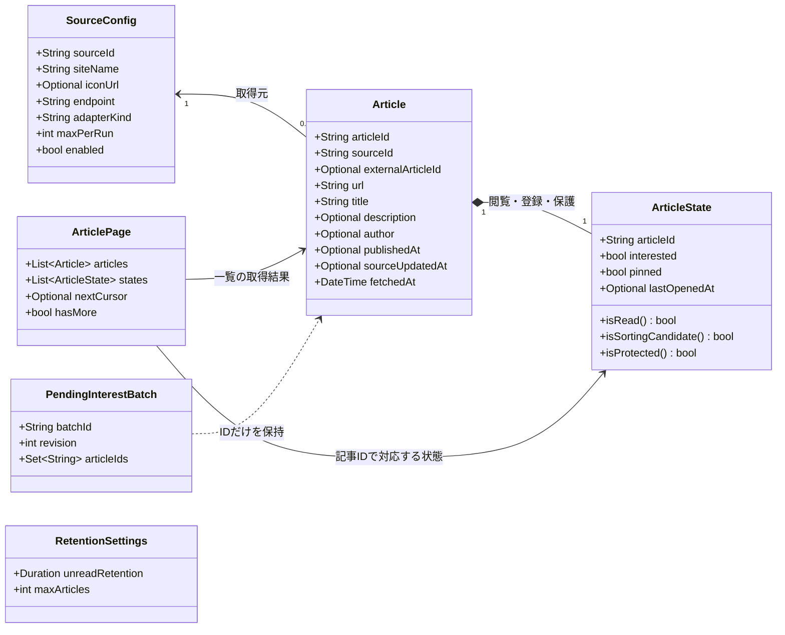
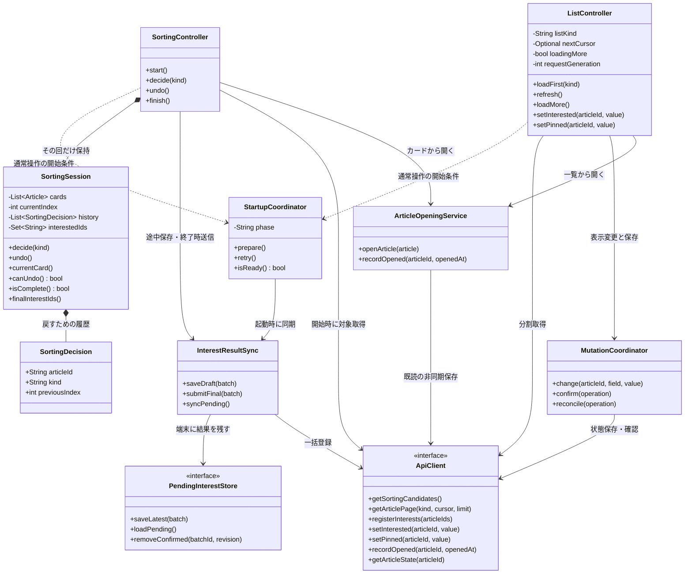
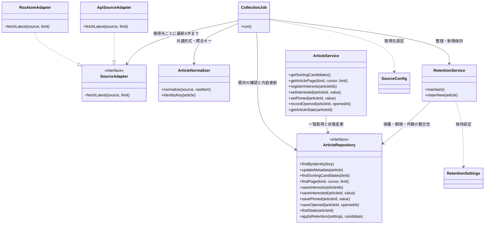

# クラス図：データ・アプリ・サーバーの責任

更新日：2026-10-09

[READMEに戻る](../README.md) · [ルール](rules.md) · [仕分けのシーケンス](sequences.md) · [一覧のシーケンス](sequences-list.md) · [サーバーのシーケンス](sequences-server.md)

現時点のルールとシーケンスから、どのデータを持ち、どの処理をどこへ置くかを整理した最初のクラス図。実装言語・フレームワーク・DBはまだ選ばず、コードの責任を表す。

今回確定した「起動時の未送信登録が保存できるまで通常操作を待機させる」と「取得先ごとに最新側から最大X件を確認する」方針を反映している。クラスの分割・メソッド名・保存の技術は設計案であり、そのまま固定する必要はない。

図の `*--` は内部に保持する関係、`-->` は参照・利用、`..>` は処理上の依存、`..|>` はインターフェースの実装を表す。`+` は外から使う操作、`-` は内部の情報。角括弧ではなく型名の `Optional` で欠損可能な値を表している。通信・端末保存のメソッドは原則として非同期。

各関数の直前に、図コードのコメント（`%%`）を付けた。コメントは図の描画には出ないため、各図のすぐ下にも同じ内容の説明表を置いている。

## 1. 記事・取得先・未送信結果のデータ



### 図1の関数コメント

| クラス | 関数 | 何をするか |
|---|---|---|
| ArticleState | `isRead()` | 元記事を開いた日時があるかを調べ、既読ならtrueを返す。 |
| ArticleState | `isSortingCandidate()` | 未読・気になる未登録・ピン止めなしの全条件を満たすかを返す。 |
| ArticleState | `isProtected()` | 気になる登録またはピン止めがあり、自動削除から保護されるかを返す。 |

| データ | コードでの意味 |
|---|---|
| SourceConfig | フィード・チャンネル・リポジトリなど一つの取得先。サービス単位だけの設定にはしない |
| Article | 元の情報の内容と日時。articleIdはアプリ内の識別子、externalArticleIdは掲載元の識別子で別物 |
| ArticleState | 気になる・ピン・閲覧の状態。lastOpenedAtがあれば既読とみなす設計案 |
| ArticlePage | 一定件数の記事と状態、次の取得位置。全記事を一度に返すものではない |
| PendingInterestBatch | 仕分けで選び、まだサーバー保存を確認できていない登録結果。見送り・カード位置・取り消し履歴は含まない |
| RetentionSettings | 記事の保持期限とDB件数上限。収集のmaxPerRunや仕分けの10件とは別の設定 |

ArticleStateには対応するarticleIdを持たせるなど、ページ内で必ず記事と対応付ける。図は論理的なデータの区分であり、ArticleとArticleStateを別DBテーブルに分ける指定ではない。現段階では個人利用を想定し、利用者・認証のクラスは置かない。複数利用者への対応はOPEN-08。

isSortingCandidate()は「未読・気になるなし・ピンなし」、isProtected()は「気になるまたはピンあり」を判定する。表示用の仮の状態とサーバーの確定状態は、同じ構造でも異なる値を持ち得る。元記事の再取得で状態を初期化しない。

同一記事判定は取得元の識別情報＋掲載元記事ID、なければURL。タイトル・著者をキーにしない。URLの正規化・取得元IDの範囲・取得日時の再取得時の扱いはOPEN-01・06。

batchIdとrevisionは、古い端末保存で新しい結果を上書きしないこと、保存確認できた結果だけ削除することを支える設計案。同じ登録を二重登録しない保証はサーバー側にも必要。

## 2. アプリ側：操作をすぐ進め、保存を分離する



### 図2の関数コメント

| クラス | 関数 | 何をするか |
|---|---|---|
| StartupCoordinator | `prepare()` | 端末の未送信登録を確認して同期する。保存成功を確認するまで通常操作を待機させる。 |
| StartupCoordinator | `retry()` | 未送信登録の同期を再試行する。成功を確認できない結果は端末に残す。 |
| StartupCoordinator | `isReady()` | 起動時の同期が完了し、一覧や仕分けの通常操作を開始できるかを返す。 |
| SortingController | `start()` | サーバーから最大10件の仕分け対象を取得し、その回の進行管理と最初のカード表示を開始する。 |
| SortingController | `decide(kind)` | スワイプの判断をSessionへ渡し、次のカードを表示する。更新後の気になる結果を端末へ非同期で保存する。 |
| SortingController | `undo()` | Sessionで直前の判断を取り消し、前のカードを表示する。端末の登録結果にも取り消しを反映する。 |
| SortingController | `finish()` | 最終的な登録結果を端末に確保してから一括送信する。保存成功後にその回を終了し、失敗なら結果を残す。 |
| SortingSession | `decide(kind)` | 現在の記事への登録または見送りをメモリ上で記録し、判断履歴を追加して現在位置を次へ進める。 |
| SortingSession | `undo()` | 直前の登録または見送りをメモリ上で取り消し、履歴を一件外してそのカードの位置へ戻る。 |
| SortingSession | `currentCard()` | 現在位置の記事を返す。カードを進めたり、保存や通信を行ったりはしない。 |
| SortingSession | `canUndo()` | その回に取り消せる判断履歴があるかを返す。戻すボタンの有効・無効に使う。 |
| SortingSession | `isComplete()` | その回の対象記事への判断が全件終わったかを返す。終了送信の成功を意味するものではない。 |
| SortingSession | `finalInterestIds()` | 取り消しを反映した、その回で最終的に選んだ気になる記事のID集合を返す。 |
| ListController | `loadFirst(kind)` | 指定した種類の一覧を先頭から一定件数取得し、記事・続き位置・続きの有無を更新する。 |
| ListController | `refresh()` | 現在の一覧を先頭から読み直し、最新の記事と新しい続き位置へ置き換える。 |
| ListController | `loadMore()` | 続きがあり追加取得中でなければ次のページを取得して追加する。失敗時は記事と続き位置を維持する。 |
| ListController | `setInterested(articleId, value)` | 対象記事の気になる表示を即座に変更し、裏で保存を依頼する。気になる一覧で解除した記事は表示から外す。 |
| ListController | `setPinned(articleId, value)` | 対象記事のピン表示を即座に変更し、裏で保存を依頼する。気になる・既読は変更しない。 |
| MutationCoordinator | `change(articleId, field, value)` | 記事の変更先の状態と操作を管理し、非同期で送信する。同じ記事・項目への変更の送信順を保つ。 |
| MutationCoordinator | `confirm(operation)` | 対応する操作の保存成功を記録し、サーバーの確定状態を更新する。古い応答で最新の操作を上書きしない。 |
| MutationCoordinator | `reconcile(operation)` | 保存結果が不明な操作についてサーバーの状態を確認し、進行中の要求や最新の操作と照合する。 |
| ArticleOpeningService | `openArticle(article)` | 記事のURLを外部で開く。開けたと判定できた場合に既読記録を依頼する。判定方法は未確定。 |
| ArticleOpeningService | `recordOpened(articleId, openedAt)` | 開けた記事を表示上の既読にし、記事IDと開いた日時の保存を非同期で依頼する。画面の進行は待たせない。 |
| InterestResultSync | `saveDraft(batch)` | 仕分け途中の登録結果を端末へ保存する。保存順を管理し、取り消し後の結果も残す。サーバーへは送信しない。 |
| InterestResultSync | `submitFinal(batch)` | 最終結果の端末保存を確認してサーバーへ一括送信する。成功確認できた結果だけを端末から削除する。 |
| InterestResultSync | `syncPending()` | 端末に残った未送信登録を読み出して再送する。成功を確認できなければ結果を残す。 |
| PendingInterestStore | `saveLatest(batch)` | 指定した登録結果を端末の保存領域に残す。古い版で新しい結果を上書きしない。 |
| PendingInterestStore | `loadPending()` | サーバーへの保存成功をまだ確認できていない登録結果を端末から読み出す。 |
| PendingInterestStore | `removeConfirmed(batchId, revision)` | 指定したbatchIdとrevisionの保存済み結果だけを端末から削除する。新しい版や別の結果を消さない。 |
| ApiClient | `getSortingCandidates()` | サーバーへ仕分け対象を要求し、対象条件を満たす最新の最大10件を受け取る。 |
| ApiClient | `getArticlePage(kind, cursor, limit)` | 一覧の種類・続き位置・取得件数を指定し、サーバーから記事の一ページと次の続き位置を受け取る。 |
| ApiClient | `registerInterests(articleIds)` | 仕分けで選んだ記事IDをまとめてサーバーへ送信し、気になる登録を保存する。 |
| ApiClient | `setInterested(articleId, value)` | 指定記事の気になる状態をvalueの値にするようサーバーへ要求する。反転する要求ではない。 |
| ApiClient | `setPinned(articleId, value)` | 指定記事のピン状態をvalueの値にするようサーバーへ要求する。気になる・既読は変更しない。 |
| ApiClient | `recordOpened(articleId, openedAt)` | 記事IDと開いた日時をサーバーへ送り、既読と最後に開いた日時を保存するよう要求する。 |
| ApiClient | `getArticleState(articleId)` | 対象記事のサーバー上の確定状態を取得する。保存結果が不明なときの確認に使う。 |

### 操作と担当の対応

| 操作 | 主に担当するクラス |
|---|---|
| 起動時に未送信登録を送る | StartupCoordinatorとInterestResultSync |
| 右・左スワイプ、戻す | SortingSession。サーバー通信を行わない |
| 判断後の端末保存、終了時の送信 | SortingControllerからInterestResultSyncへ依頼 |
| 一覧の初回・更新・追加取得 | ListController |
| 一覧の登録・ピンをすぐ表示へ反映して保存 | ListControllerとMutationCoordinator |
| 元記事を開く、既読の保存を依頼する | ArticleOpeningService。戻り先の表示は各画面側 |

画面コンポーネントはControllerの操作を呼び、返された表示用状態を描画する。ControllerにHTMLや具体的な画面部品を置く指定ではない。SortingSessionはメモリ上の進行管理で、端末の未送信保存とは別。次回起動でこのSessionを復元しない。

StartupCoordinatorは、端末に未送信登録があれば同期成功まで一覧・仕分け操作を開放しない。通常の通信失敗は間隔を空けて再試行し、利用者は再試行を続けるかアプリを終了するか選べる。終了しても登録結果は消さない。未送信登録がなければ通常操作へ進める。

MutationCoordinatorは一覧の最新操作とサーバーの確定状態を分けて管理する。古い応答で新しい表示を戻さず、同じ記事・同じ項目への送信順も保つ。気になる解除で外した記事を失敗時に戻す表示処理はListControllerが担当し、気になる・ピン以外の状態まで戻さない。

PendingInterestStoreとApiClientの実装は、それぞれ端末保存の技術と通信方式を選んでから用意する。一覧の未確定変更も端末へ永続保存するかは未決であり、このPendingInterestStoreへ自動的に含める仕様にはしない。

### コードの流れの例

以下は言語に依存しない疑似コード。仕分けの判断と、待ち時間を発生させる保存を分ける。

```text
スワイプしたとき:
    session.decide(登録または見送り)
    次のカードまたは完了画面を表示
    sync.saveDraft(現在の登録結果) を非同期で依頼

戻すとき:
    session.undo()
    戻ったカードとボタン状態を表示
    sync.saveDraft(更新後の登録結果) を非同期で依頼

終了するとき:
    sync.submitFinal(最終結果) を実行
    最終結果の端末保存を確認してからサーバーへ送信
    保存成功なら送信済み結果を端末から消し、sessionを破棄
    保存を確認できなければ結果を残す
```

InterestResultSyncは、saveDraftの呼び出し順序と最終送信前の保存完了を管理する。個々の画面へ再送ロジックを重複させない。

## 3. サーバー側：記事取得・利用者状態・保持を分ける



### 図3の関数コメント

| クラス | 関数 | 何をするか |
|---|---|---|
| CollectionJob | `run()` | 定期収集を一回実行する。取得先ごとに最新側から最大X件を確認し、変換・既存更新・新規保持へ振り分ける。 |
| SourceAdapter | `fetchLatest(source, limit)` | 指定した取得先から最新側の最大limit件を取得するための共通の窓口。取得方法は各実装が担当する。 |
| RssAtomAdapter | `fetchLatest(source, limit)` | RSSまたはAtomを読み、提供されている記事の最新側から最大limit件を返す。 |
| ApiSourceAdapter | `fetchLatest(source, limit)` | 掲載元のAPIを使い、最新側から最大limit件の記事データを取得して返す。 |
| ArticleNormalizer | `normalize(source, rawItem)` | 掲載元のデータ一件を、タイトル・URL・説明・日時などアプリ共通の記事形式へ変換する。 |
| ArticleNormalizer | `identityKey(article)` | 同一記事を照合するキーを作る。取得元の識別情報と掲載元の記事IDを使い、記事IDがなければURLを使う。 |
| ArticleService | `getSortingCandidates()` | 対象条件を満たす記事を取得日時が新しい順に最大10件選び、アプリへ返す。 |
| ArticleService | `getArticlePage(kind, cursor, limit)` | 全記事または気になる一覧の条件で一ページを取得し、記事と状態・続き位置をアプリへ返す。 |
| ArticleService | `registerInterests(articleIds)` | 渡された記事IDをまとめて気になるに登録する。再送されても二重登録しない。 |
| ArticleService | `setInterested(articleId, value)` | 指定記事の気になる状態だけを変更先の値で保存する。既読・ピン止めは維持する。 |
| ArticleService | `setPinned(articleId, value)` | 指定記事のピン状態だけを変更先の値で保存する。気になる・既読は維持する。 |
| ArticleService | `recordOpened(articleId, openedAt)` | 指定記事を既読にし、最後に開いた日時を保存する。気になる・ピン止めは維持する。 |
| ArticleService | `getArticleState(articleId)` | 指定記事の確定した登録・ピン・閲覧状態をDBから取得して返す。 |
| RetentionService | `maintain()` | 新規記事を渡さずに保持条件を見直し、期限・件数に応じて既存記事を整理する。 |
| RetentionService | `retainNew(article)` | 新規記事の追加可否を判定し、保持できる場合は追加と期限・件数整理を行う。保護記事だけで上限なら追加しない。 |
| ArticleRepository | `findByIdentity(key)` | 照合キーに一致する既存記事をDBから探す。新規記事か既存記事かの判定に使う。 |
| ArticleRepository | `updateMetadata(article)` | 既存記事のタイトル・説明・掲載元の日時などを更新する。登録・既読・ピン止めを初期化しない。 |
| ArticleRepository | `findSortingCandidates(limit)` | 未読・気になる未登録・ピン止めなしの記事を取得日時が新しい順に最大limit件取得する。 |
| ArticleRepository | `findPage(kind, cursor, limit)` | 一覧の種類・続き位置・取得件数に従って、DBから記事と状態の一ページを取得する。 |
| ArticleRepository | `saveInterests(articleIds)` | 指定した記事IDをまとめて気になる登録としてDBに保存する。同じ登録の再送で重複を作らない。 |
| ArticleRepository | `saveInterested(articleId, value)` | 指定記事の気になる状態だけをDBに保存する。 |
| ArticleRepository | `savePinned(articleId, value)` | 指定記事のピン状態だけをDBに保存する。 |
| ArticleRepository | `saveOpened(articleId, openedAt)` | 指定記事の既読と最後に開いた日時をDBに保存する。 |
| ArticleRepository | `findState(articleId)` | 指定記事の現在の登録・ピン・閲覧状態をDBから取得する。 |
| ArticleRepository | `applyRetention(settings, candidate)` | 保持設定に従って期限・件数を整理し、candidateがあれば新規追加も判定する。保護条件を守り、一つの保存単位で確定する案。 |

SourceConfigとRetentionSettingsは図1と同じデータ。定期実行の基盤がCollectionJob.run()を呼び、APIの入口がArticleServiceを呼ぶ。実行基盤・HTTPルート・DB接続の具体的なクラスは今の図から省略している。

| クラス | 責任と境界 |
|---|---|
| CollectionJob | 取得先を順に処理して新規追加・既存更新へ振り分ける。利用者のスワイプは扱わない |
| SourceAdapter | 外部の取得方法の違いを吸収する。毎回最新側から最大X件を確認する |
| ArticleNormalizer | タイトル・説明・日時などを共通形式へ変換し、同一記事の照合キーを作る |
| ArticleService | アプリからの要求を処理する。仕分けの戻す履歴やカード位置を持たない |
| RetentionService | 保護・期限・件数のルールで保持と削除を管理する。新規停止中も既存更新は止めない |
| ArticleRepository | DBへの取得・保存と整合性の境界。利用者の状態を内容更新で消さず、保護された記事を削除しない |

RssAtomAdapterとApiSourceAdapterは候補となる実装の例。APIの仕様が出典ごとに違えば、別のAdapterへ分ける。取得範囲を制御できないRSSでも、提供されている範囲から最新側の最大X件を選ぶ。前回の古い未取得分から追い続ける方式にはせず、取りこぼしは許容する。既存記事の更新確認は毎回の取得範囲内で行い、範囲外の過去記事を全件巡回する仕様ではない。

applyRetentionは、保持ルールを満たすDB処理を一つの保存単位で確定するための操作を表す。設計の初期案としてRepositoryに集約しており、DBを選んだ後で問い合わせやトランザクションの責任を分け直せる。candidateがない場合は整理だけを実行する。

## 保存先と通信の境界

| 情報 | 保存・管理する場所 |
|---|---|
| 記事・確定した気になる／既読／ピン | サーバーDB |
| その回のカード位置・判断履歴 | アプリのメモリだけ |
| 仕分けの未送信気になる結果 | 端末の保存領域。成功確認後に削除 |
| 一覧の楽観的な表示・未確定操作 | アプリ側。端末への永続保存は未決 |
| 取得先・保持期限・件数などの設定 | 配置は実装時に選ぶ。数値をコード中へ固定しない |

サーバーへの送信は、仕分けでは開始時と終了時、一覧ではページ取得・状態変更のとき。既読は画面を待たせない非同期保存案。外部を開けたかの判定、アプリ中断時の送信継続は実装環境の調査が必要。

## 残る確認事項

- OPEN-02：仕分け中の一覧移動は必須にしない方向。中断操作を設けるか、設けた場合の保存・終了はまだ確定していない。
- OPEN-03：元記事から同じカードへ戻ることは確定。既読カードでも右・左スワイプで次へ進む案を置いているが、操作と件数への数え方は要確認。
- OPEN-05：外部を開けたかの判定。ArticleOpeningServiceの実装を選ぶときに調べる。
- OPEN-12：起動時の再送と通常操作の競合は同期待機で避ける。端末保存失敗、送信前に削除済みの記事、成功確認できた結果の識別は引き続き設計する。
- OPEN-14：一覧の未確定変更を、アプリ終了後も端末から再送するか。
- OPEN-01・06・07・10・13・15：日時・照合・実行基盤・具体値・ページング・DB同時操作の詳細。

一時的な通信失敗への再試行と、登録対象が削除済みなど再試行だけでは直らないエラーは区別する。起動時の同期待機で後者をどう扱うかは未決であり、解決するまで無限再送する仕様にはしない。

この図でまず確認したいのは、仕分けの進行と保存が別であること、一覧と仕分けが記事を開く処理を共有すること、外部取得とDB保持の責任が分かれること。個々のメソッドやファイル配置は、この分担を確認してから実装に合わせて具体化する。
