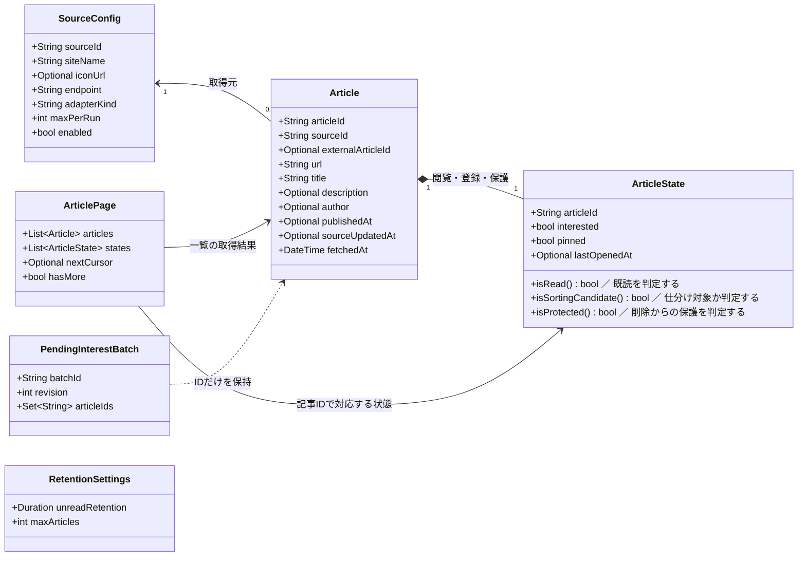
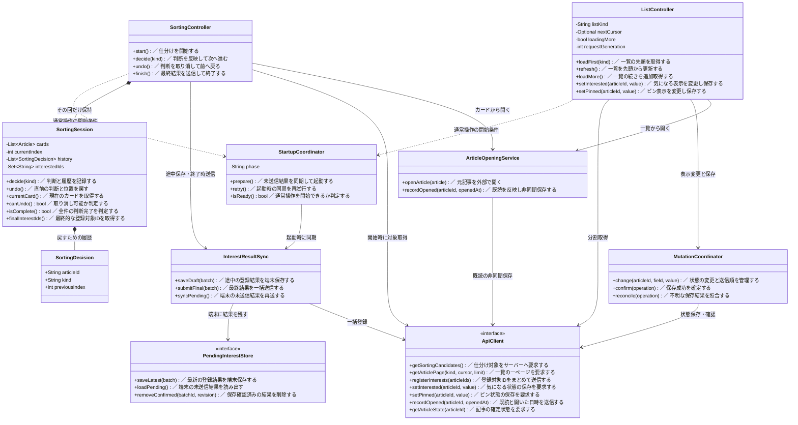
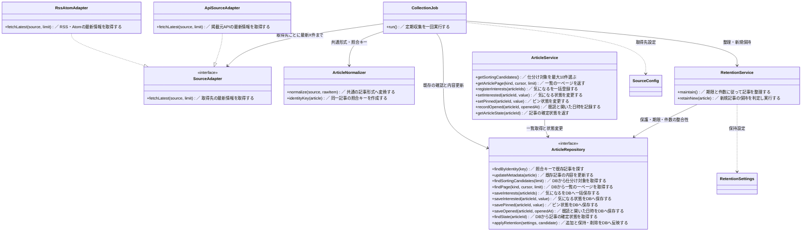

# クラス図：データ・アプリ・サーバーの責任

更新日：2026-10-09

[READMEに戻る](../README.md) · [ルール](rules.md) · [仕分けのシーケンス](sequences.md) · [一覧のシーケンス](sequences-list.md) · [サーバーのシーケンス](sequences-server.md)

現時点のルールとシーケンスから、どのデータを持ち、どの処理をどこへ置くかを整理した最初のクラス図。実装言語・フレームワーク・DBはまだ選ばず、コードの責任を表す。

今回確定した「起動時の未送信登録が保存できるまで通常操作を待機させる」と「取得先ごとに最新側から最大X件を確認する」方針を反映している。クラスの分割・メソッド名・保存の技術は設計案であり、そのまま固定する必要はない。

図の `*--` は内部に保持する関係、`-->` は参照・利用、`..>` は処理上の依存、`..|>` はインターフェースの実装を表す。`+` は外から使う操作、`-` は内部の情報。角括弧ではなく型名の `Optional` で欠損可能な値を表している。通信・端末保存のメソッドは原則として非同期。

各メソッドの右側に、短い日本語のコメントを表示している。`／` の後は処理の説明であり、戻り値の型ではない。

## 1. 記事・取得先・未送信結果のデータ




| データ | コードでの意味 |
|---|---|
| SourceConfig | フィード・チャンネル・リポジトリなど一つの取得先。サービス単位だけの設定にはしない |
| Article | 元の情報の内容と日時。articleIdはアプリ内の識別子、externalArticleIdは掲載元の識別子で別物 |
| ArticleState | 気になる・ピン・閲覧の状態。lastOpenedAtがあれば既読とみなす設計案 |
| ArticlePage | 一定件数の記事と状態、次の取得位置。全記事を一度に返すものではない |
| PendingInterestBatch | 仕分けで選び、まだサーバー保存を確認できていない登録結果。見送り・カード位置・取り消し履歴は含まない |
| RetentionSettings | 記事の保持期限とDB件数上限。収集のmaxPerRunや仕分けの10件とは別の設定 |

ArticleStateには対応するarticleIdを持たせるなど、ページ内で必ず記事と対応付ける。図は論理的なデータの区分であり、ArticleとArticleStateを別DBテーブルに分ける指定ではない。現段階では個人利用を想定し、利用者・認証のクラスは置かない。複数利用者への対応はOPEN-08。

isSortingCandidate()は「未読・気になるなし・ピンなし」、isProtected()は「気になるまたはピンあり」を判定する。表示用の仮の状態とサーバーの確定状態は、同じ構造でも異なる値を持ち得る。元記事の再取得で状態を初期化しない。

同一記事判定は取得元の識別情報＋掲載元記事ID、なければURL。タイトル・著者をキーにしない。URLの正規化・取得元IDの範囲・取得日時の再取得時の扱いはOPEN-01・06。

batchIdとrevisionは、古い端末保存で新しい結果を上書きしないこと、保存確認できた結果だけ削除することを支える設計案。同じ登録を二重登録しない保証はサーバー側にも必要。

## 2. アプリ側：操作をすぐ進め、保存を分離する




### 操作と担当の対応

| 操作 | 主に担当するクラス |
|---|---|
| 起動時に未送信登録を送る | StartupCoordinatorとInterestResultSync |
| 右・左スワイプ、戻す | SortingSession。サーバー通信を行わない |
| 判断後の端末保存、終了時の送信 | SortingControllerからInterestResultSyncへ依頼 |
| 一覧の初回・更新・追加取得 | ListController |
| 一覧の登録・ピンをすぐ表示へ反映して保存 | ListControllerとMutationCoordinator |
| 元記事を開く、既読の保存を依頼する | ArticleOpeningService。戻り先の表示は各画面側 |

画面コンポーネントはControllerの操作を呼び、返された表示用状態を描画する。ControllerにHTMLや具体的な画面部品を置く指定ではない。SortingSessionはメモリ上の進行管理で、端末の未送信保存とは別。次回起動でこのSessionを復元しない。

StartupCoordinatorは、端末に未送信登録があれば同期成功まで一覧・仕分け操作を開放しない。通常の通信失敗は間隔を空けて再試行し、利用者は再試行を続けるかアプリを終了するか選べる。終了しても登録結果は消さない。未送信登録がなければ通常操作へ進める。

MutationCoordinatorは一覧の最新操作とサーバーの確定状態を分けて管理する。古い応答で新しい表示を戻さず、同じ記事・同じ項目への送信順も保つ。気になる解除で外した記事を失敗時に戻す表示処理はListControllerが担当し、気になる・ピン以外の状態まで戻さない。

PendingInterestStoreとApiClientの実装は、それぞれ端末保存の技術と通信方式を選んでから用意する。一覧の未確定変更も端末へ永続保存するかは未決であり、このPendingInterestStoreへ自動的に含める仕様にはしない。

### コードの流れの例

以下は言語に依存しない疑似コード。仕分けの判断と、待ち時間を発生させる保存を分ける。

```text
スワイプしたとき:
    session.decide(登録または見送り)
    次のカードまたは完了画面を表示
    sync.saveDraft(現在の登録結果) を非同期で依頼

戻すとき:
    session.undo()
    戻ったカードとボタン状態を表示
    sync.saveDraft(更新後の登録結果) を非同期で依頼

終了するとき:
    sync.submitFinal(最終結果) を実行
    最終結果の端末保存を確認してからサーバーへ送信
    保存成功なら送信済み結果を端末から消し、sessionを破棄
    保存を確認できなければ結果を残す
```

InterestResultSyncは、saveDraftの呼び出し順序と最終送信前の保存完了を管理する。個々の画面へ再送ロジックを重複させない。

## 3. サーバー側：記事取得・利用者状態・保持を分ける




SourceConfigとRetentionSettingsは図1と同じデータ。定期実行の基盤がCollectionJob.run()を呼び、APIの入口がArticleServiceを呼ぶ。実行基盤・HTTPルート・DB接続の具体的なクラスは今の図から省略している。

| クラス | 責任と境界 |
|---|---|
| CollectionJob | 取得先を順に処理して新規追加・既存更新へ振り分ける。利用者のスワイプは扱わない |
| SourceAdapter | 外部の取得方法の違いを吸収する。毎回最新側から最大X件を確認する |
| ArticleNormalizer | タイトル・説明・日時などを共通形式へ変換し、同一記事の照合キーを作る |
| ArticleService | アプリからの要求を処理する。仕分けの戻す履歴やカード位置を持たない |
| RetentionService | 保護・期限・件数のルールで保持と削除を管理する。新規停止中も既存更新は止めない |
| ArticleRepository | DBへの取得・保存と整合性の境界。利用者の状態を内容更新で消さず、保護された記事を削除しない |

RssAtomAdapterとApiSourceAdapterは候補となる実装の例。APIの仕様が出典ごとに違えば、別のAdapterへ分ける。取得範囲を制御できないRSSでも、提供されている範囲から最新側の最大X件を選ぶ。前回の古い未取得分から追い続ける方式にはせず、取りこぼしは許容する。既存記事の更新確認は毎回の取得範囲内で行い、範囲外の過去記事を全件巡回する仕様ではない。

applyRetentionは、保持ルールを満たすDB処理を一つの保存単位で確定するための操作を表す。設計の初期案としてRepositoryに集約しており、DBを選んだ後で問い合わせやトランザクションの責任を分け直せる。candidateがない場合は整理だけを実行する。

## 保存先と通信の境界

| 情報 | 保存・管理する場所 |
|---|---|
| 記事・確定した気になる／既読／ピン | サーバーDB |
| その回のカード位置・判断履歴 | アプリのメモリだけ |
| 仕分けの未送信気になる結果 | 端末の保存領域。成功確認後に削除 |
| 一覧の楽観的な表示・未確定操作 | アプリ側。端末への永続保存は未決 |
| 取得先・保持期限・件数などの設定 | 配置は実装時に選ぶ。数値をコード中へ固定しない |

サーバーへの送信は、仕分けでは開始時と終了時、一覧ではページ取得・状態変更のとき。既読は画面を待たせない非同期保存案。外部を開けたかの判定、アプリ中断時の送信継続は実装環境の調査が必要。

## 残る確認事項

- OPEN-02：仕分け中の一覧移動は必須にしない方向。中断操作を設けるか、設けた場合の保存・終了はまだ確定していない。
- OPEN-03：元記事から同じカードへ戻ることは確定。既読カードでも右・左スワイプで次へ進む案を置いているが、操作と件数への数え方は要確認。
- OPEN-05：外部を開けたかの判定。ArticleOpeningServiceの実装を選ぶときに調べる。
- OPEN-12：起動時の再送と通常操作の競合は同期待機で避ける。端末保存失敗、送信前に削除済みの記事、成功確認できた結果の識別は引き続き設計する。
- OPEN-14：一覧の未確定変更を、アプリ終了後も端末から再送するか。
- OPEN-01・06・07・10・13・15：日時・照合・実行基盤・具体値・ページング・DB同時操作の詳細。

一時的な通信失敗への再試行と、登録対象が削除済みなど再試行だけでは直らないエラーは区別する。起動時の同期待機で後者をどう扱うかは未決であり、解決するまで無限再送する仕様にはしない。

この図でまず確認したいのは、仕分けの進行と保存が別であること、一覧と仕分けが記事を開く処理を共有すること、外部取得とDB保持の責任が分かれること。個々のメソッドやファイル配置は、この分担を確認してから実装に合わせて具体化する。
