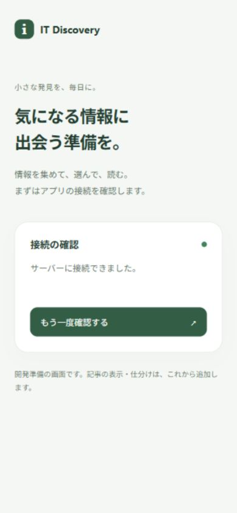

# 開発基盤の起動と確認

[README](../README.md) · [技術構成](architecture.md)

Issue #5の範囲は、VueからNestの疎通確認APIへ接続するところまで。記事一覧・仕分け・DB・収集・認証・本番公開は後続Issueで追加する。今の画面は接続確認用で、採用した記事カードUIの実装ではない。

## 必要な環境

- Node.js 24.15以降の24 LTS。Nest CLIの間接依存と、JestからNest 12のES Modulesを読む互換性を含めた要件に合わせる。Node.js 22はこの基盤の対象にしない。
- npm 10以上。npm workspacesを使い、依存はルートのpackage-lock.jsonで固定する。
- Git。

TypeScriptは5.9系を使う。今回のVue型チェックとNestのコンパイルで互換性を確認し、TypeScript 7への移行は含めない。Pinia・Vue Router・DB・idb・定期実行のパッケージは、使う機能のIssueで追加する。

.npmrcでNode.jsの要件を満たさないインストールを拒否する。Nest 12のES ModulesをJestが読み込むため、APIのテストコマンドだけでNodeのexperimental-vm-modulesを指定する。通常のアプリ起動には指定しない。

## 初回の起動

リポジトリのルートで実行する。別々のターミナルを使う必要はない。

```sh
npm ci
npm run dev
```

Nestの「Nest application successfully started」が出たら、http://127.0.0.1:5173/ を開く。「サーバーに接続できました。」が表示されれば、Vue → Axios → Viteのプロキシ → Nestの通信が成功している。ボタンで再確認できる。API起動前に開いた場合や接続失敗時はメッセージと再試行ボタンを表示する。APIが起動・復旧した後に再試行すると成功表示へ戻る。



APIだけを確認する場合は http://127.0.0.1:3000/api/health を開く。

```json
{"status":"ok","message":"サーバーに接続できました。"}
```

これはプロセスの疎通確認であり、DBや外部情報源の正常性を保証するAPIではない。

`npm run dev`は共有型を先にビルドし、共有型・Nest・Viteを監視する。どれかが終了したら他も終了する。終了はCtrl+C。既定のポートが使われていれば勝手に別ポートへ切り替えず、設定を直して起動し直す。

## 設定

既定値で起動する場合は.envを作らなくてもよい。変更する場合は、次の各ファイルを同じフォルダ内の.envへコピーする。

- [apps/api/.env.example](../apps/api/.env.example) → apps/api/.env
- [apps/web/.env.example](../apps/web/.env.example) → apps/web/.env

PowerShellでは次のようにコピーできる。

```powershell
Copy-Item apps/api/.env.example apps/api/.env
Copy-Item apps/web/.env.example apps/web/.env
```

| 変数 | 既定値 | 読む場所と役割 |
|---|---|---|
| HOST | 127.0.0.1 | Nestの待受アドレス |
| PORT | 3000 | Nestの待受ポート |
| CORS_ORIGINS | 空 | Nestが許可するフロントのオリジン。カンマ区切り、パス・末尾の/・*は禁止 |
| WEB_PORT | 5173 | Viteの開発用ポート |
| DEV_API_TARGET | http://127.0.0.1:3000 | ViteからNestへの転送先。/apiは付けない |
| VITE_API_BASE_URL | /api | ブラウザのAxiosが呼ぶベースURL。/apiまで含める |

例えばAPIを4100番にする場合、apiのPORTを4100、webのDEV_API_TARGETをhttp://127.0.0.1:4100にする。VITE_API_BASE_URLは/apiのままでよい。webの/api/health要求はNestの/api/healthへ、そのまま転送される。

設定変更後は開発プロセスを終了して起動し直す。シェルの環境変数は.envより優先される。npmのworkspaceコマンドは各アプリのフォルダで実行されるので、Nestはapps/api/.env、Viteはapps/web/.envを読む。

別オリジンからAPIへ直接接続する場合は、VITE_API_BASE_URLをAPIの絶対URL（例：https://api.example.com/api）にし、NestのCORS_ORIGINSにフロントのオリジンを設定する。開発のプロキシ経由ならCORS設定は不要。CORSは認証ではない。本人用アクセス制限とHTTPSは#23・#24で用意する。

VITE_変数はビルド時に配布ファイルへ含まれる。秘密情報を入れない。本番の接続先変更はwebの再ビルドが必要。Viteの開発プロキシは配布したdistでは動かない。

## ビルド・型チェック・テスト

```sh
npm run typecheck
npm run test
npm run build
```

| コマンド | 確認すること |
|---|---|
| typecheck | 共有型・Nest・Vueの型の整合性 |
| test | Jestでサーバー設定の誤り、Vitestで通信中の連打と失敗後の再試行 |
| build | 共有型の宣言ファイル、Nestの実行コード、Vueの配布ファイルを順に生成する |

生成先はpackages/contracts/dist、apps/api/dist、apps/web/dist。Gitへ含めない。

ビルドしたAPIの起動：

```sh
npm run start -w @it-discovery/api
```

ビルドしたwebだけの表示確認：

```sh
npm run preview -w @it-discovery/web
```

previewはローカルの表示確認用で、本番公開用サーバーではない。APIも起動しておく。直接APIへ接続する構成の確認では、ビルド前のweb設定とAPIのCORS設定を揃える。

## コードを読む順序

1. apps/web/src/app/App.vue：表示とボタン入力。
2. apps/web/src/features/connection/useConnectionCheck.ts：通信中・成功・失敗の状態と再試行。
3. apps/web/src/infrastructure/api/api-client.ts：Axiosの共通設定と疎通API。
4. apps/api/src/health/health.controller.ts：HTTPの入口と応答。
5. packages/contracts/src/index.ts：両側で共有する応答の型。

設定はapps/web/vite.config.ts、apps/api/src/config/server.config.ts、起動はapps/api/src/main.tsで確認できる。APIクライアントは共有型だけを信用せず、受け取ったJSONの最小形式も確認する。

## Gitに入れるもの

package-lock.json、ソース、設定例は管理する。.env、node_modules、dist、DB本体とその付随ファイル、調査スクリプトの生成データは.gitignoreで除外する。実際の秘密情報は設定例にも記載しない。

## Issue #5の検証記録

Windows、Node.js 24.21.0、npm 10.9.9でnpm ci、typecheck、test、buildを確認した。Jestは12件、Vitestは2件が成功。ブラウザで接続失敗後の再試行と390px幅の表示を確認した。既定のViteプロキシ、APIの4100番への変更、CORSで指定したオリジンだけに許可ヘッダーが付くことも確認した。

2026-10-09のnpm audit --omit=devは指摘0件。開発用依存を含む監査には、Jest系の間接依存sprintf-jsのDoSに起因するmoderateの指摘が20件残る。固定した版では修正版が提供されておらず、古いJestへの強制変更は行っていない。実行用依存には含まれない。後続のCI・依存更新で継続確認する。
