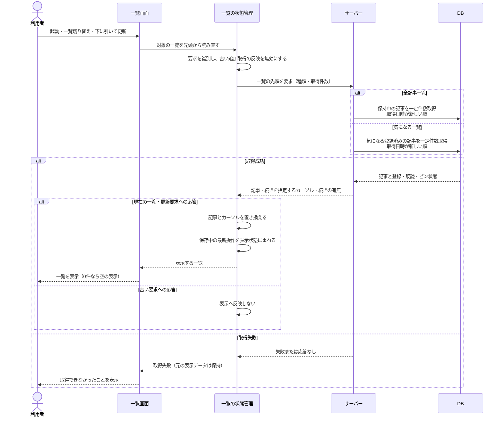
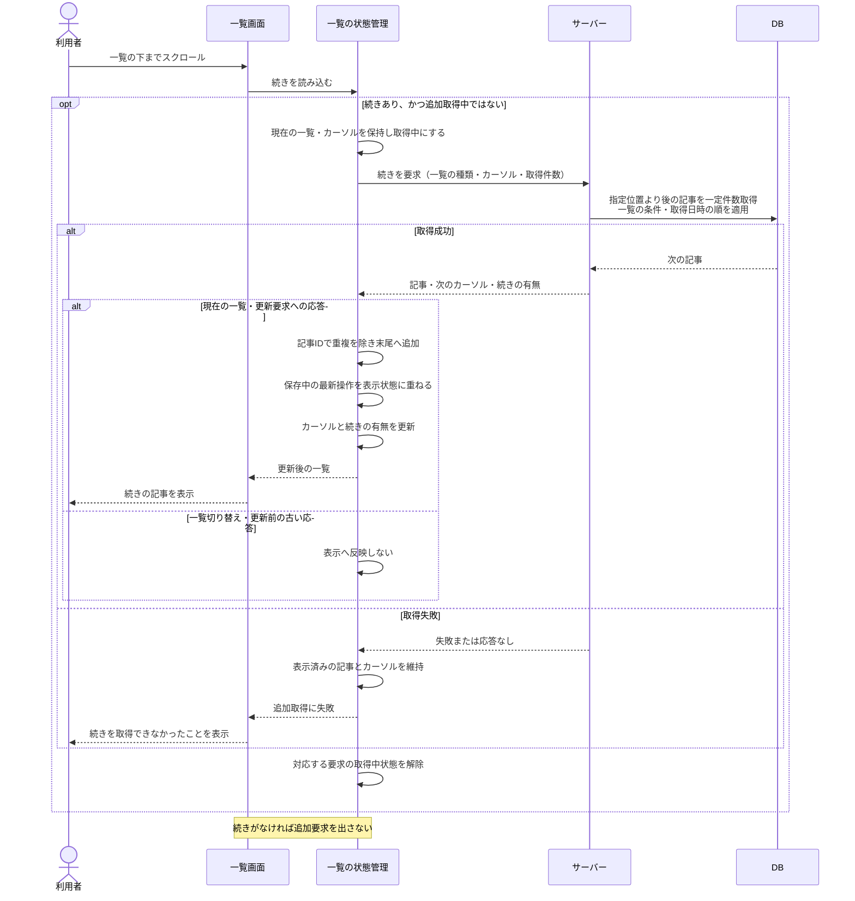
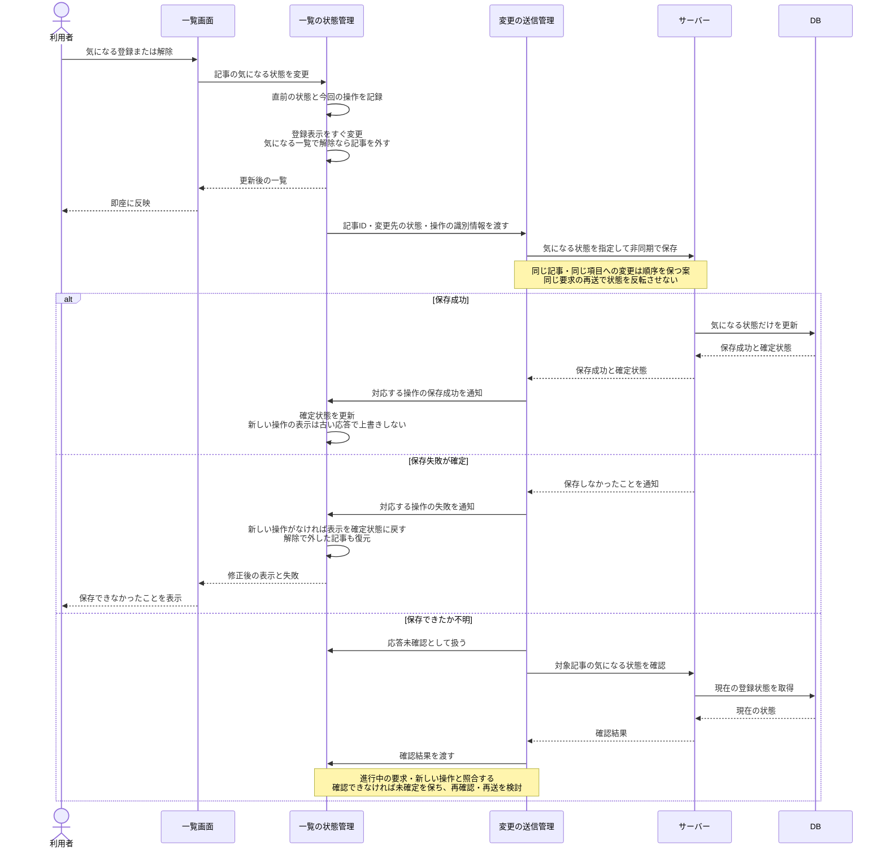
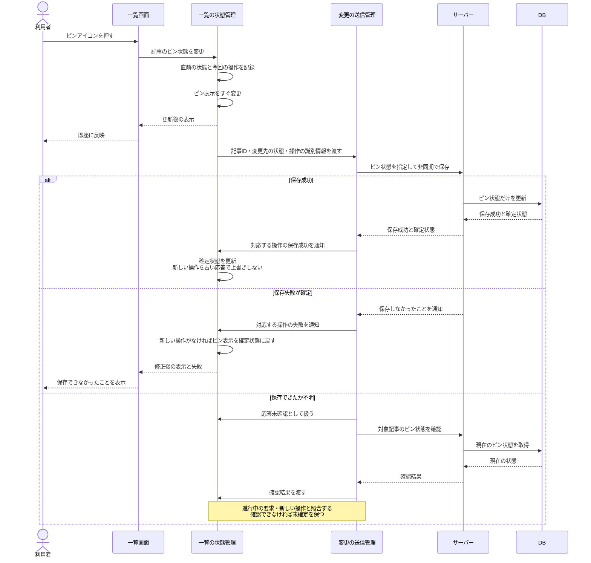

# シーケンス図：一覧の取得と状態変更

更新日：2026-10-08

[READMEに戻る](../README.md) · [ルール](rules.md) · [仕分けのシーケンス](sequences.md) · [状態遷移図](state-transitions.md)

全記事一覧・気になる一覧は全件を一括取得せず、スクロールに応じて続きを取得する。登録・解除・ピン操作は画面へすぐ反映し、サーバーへ非同期で保存する。保存成功まで表示変更を待つ以前の案を、この方式に置き換える。

図は責任と処理順を検討する設計資料であり、実装済みの挙動ではない。画面の状態管理・変更の送信管理は役割を表し、クラス名やAPI名は未確定。

## 1. 一覧の初回表示・切り替え・更新

起動・一覧切り替え・下に引く更新では、対象の一覧の先頭を一定件数取得する。外部情報源への収集は呼ばない。更新が成功してから表示済みの記事を置き換える案で描く。

ルール：UI-04、LIST-04〜08、COLLECT-02〜03。

カーソルは「どこから続きを取得するか」を表す情報。取得件数の具体値は未確定。起動時の仕分け結果の再送と一覧取得の順序はOPEN-12のまま。

取得日時と記事の識別子を組み合わせて順序を安定させる実装案とする。同じ取得日時の記事の具体的な順序、取得日時の再取得時の扱いはOPEN-01・10で決める。

## 2. スクロールで続きを取得する

続きがあり、追加取得中でなければ取得する。同じ続きを重複して要求せず、成功したときだけカーソルを進める。

ルール：LIST-06〜08。下に引いて更新すると図1の先頭取得へ戻る。新規記事をスクロール中の先頭へ自動挿入する処理はこの図に含めない。

カーソル方式は、件数による位置指定よりも途中の新規追加によるずれを避けやすい設計案。既存記事の取得日時や気になる状態が変わる場合まで、全件を漏れなく固定表示する保証ではない。取得中の変更・削除との整合性、サーバーのカーソル定義はOPEN-13で詰める。

## 3. 気になる登録・解除をすぐ画面に反映する

気になる一覧で解除した記事は、その場で一覧から外す。保存が失敗したと確定した場合は、最新の操作との関係を確認して表示を戻す。応答がないだけの場合は、保存されている可能性があるため直ちに戻さない。

ルール：LIST-01〜03、09〜12。既読・ピン止めは変更しない。

単に過去の一覧全体を保存して戻すと、他の記事への操作まで消してしまう。戻す対象は失敗した記事の気になる状態だけとし、解除した記事の復元位置も現在の並び順に合わせる。

同じ記事を連続操作した場合、画面は最新の判断を即時表示する。サーバーにも最終的な判断が残るよう送信順を管理する。応答の表示だけを無視しても、サーバーで保存順が逆転すれば不整合になるため、送信の順序も必要。

確認要求の応答時点で元の保存要求がまだ処理中の場合は、その確認結果だけで失敗と断定しない。具体的なタイムアウト・再確認・再送・連続操作の管理方法はOPEN-14で決める。

## 4. ピン止め・解除をすぐ画面に反映する

ピン状態も楽観的に表示を変え、裏で保存する。ピン操作によって気になる状態や既読を変更しない。

ルール：PIN-01〜03、LIST-09〜12。送信順・再送・古い応答の扱いは気になる操作と共通にする。

画面上のピン表示が変わっても、サーバーの自動削除から保護されるのはDB保存後。解除しても気になる登録が残っていれば保護は続く。解除操作自体では削除せず、通常の削除判定に従う。

## 未決事項と残りのシーケンス

- 一回の取得件数、カーソルの詳細、更新中の一覧の扱いはOPEN-10・13。
- 起動時の仕分け結果の再送、一覧からの解除との競合はOPEN-12。
- 保存失敗後の具体的な操作、連続操作、アプリ終了時の一覧操作の未確定変更、削除済み記事への操作はOPEN-09・14。
- 一覧から元記事を開く処理、サーバーの定期収集・更新、保持期限・件数による削除は未作成。

一覧の変更を仕分けと同じ終了時の一括送信にする仕様ではない。端末への永続保存・次回起動時の再送を一覧の操作にも適用するかは、OPEN-14で別途決める。
