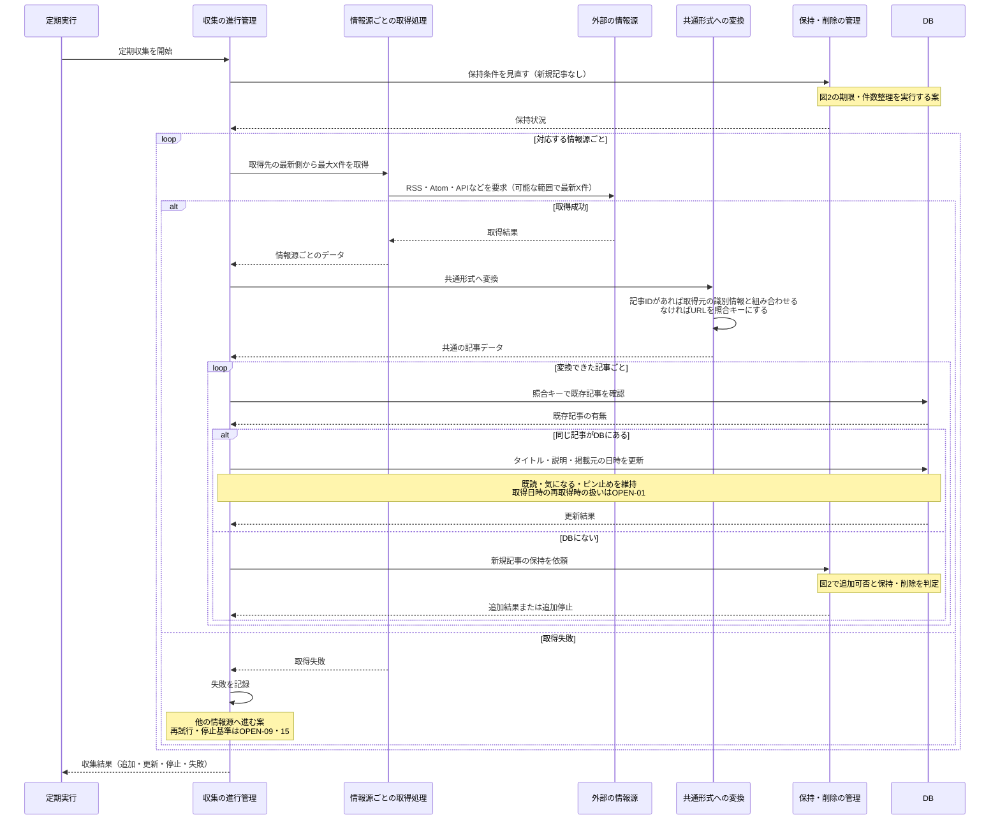
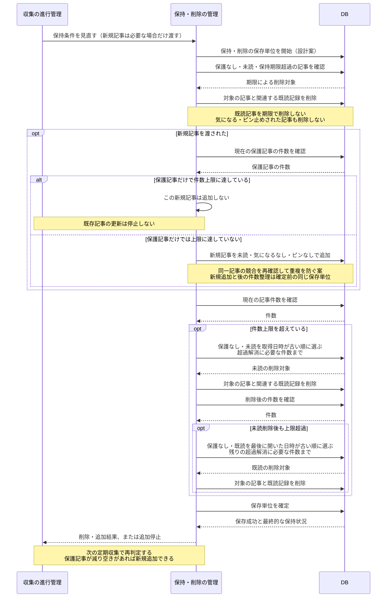

# シーケンス図：定期収集と記事の保持・削除

更新日：2026-10-09

[READMEに戻る](../README.md) · [ルール](rules.md) · [状態遷移図](state-transitions.md) · [仕分けのシーケンス](sequences.md) · [一覧のシーケンス](sequences-list.md)

サーバーが取得先ごとに毎回最新側から最大X件を確認して記事を追加・更新する処理と、保持期限・件数・保護状態に従って記事を保持する処理を分ける。取りこぼしは許容し、古い未取得分から追い続ける方式にはしない。起動時や一覧更新で外部の収集を呼ぶ構成にはしない。

## 登場人物と設計案

| 登場人物 | 役割 |
|---|---|
| 定期実行 | Compute Engineの起動中のNestで収集を開始する。間隔は未確定 |
| 収集の進行管理 | 情報源ごとの取得、変換、同一記事判定、追加・更新を進める |
| 情報源ごとの取得処理 | RSS・Atom・APIなど、出典ごとの取得方法を担当する |
| 外部の情報源 | 記事や更新情報の掲載元 |
| 共通形式への変換 | 取得結果をアプリ共通の記事データへ揃え、同一記事の照合キーを作る |
| 保持・削除の管理 | 保護・期限・件数を確認し、新規追加の可否と削除対象を決める |
| DB | 記事の内容と既読・気になる・ピン止めを保持する |

役割を示す名前であり、具体的なファイルへの対応は[技術構成](architecture.md)を参照する。実行基盤はNestの@nestjs/schedule、保存はSQLiteとする。推薦・類似度・興味の推定は含めない。

図2では、期限の整理、新規追加の判定、件数の整理を一つの保存単位で実行する案にしている。収集開始時の整理と、新規記事を保持するときの整理で同じ責任を呼ぶ。削除の実行タイミング・トランザクションの境界はOPEN-15で検討する。外部通信の間までDBの保存処理を占有し続ける設計にはしない。

## 1. 記事を定期収集して追加・更新する

新規追加が停止中でも情報源の取得と既存記事の更新は続ける。収集全体を停止する処理にはしない。

ルール：COLLECT-01・03〜05、ID-01〜02、UPDATE-01〜04、KEEP-07〜09。

公開日時と取得日時は別に持つ。掲載元の更新日時を取得できれば公開日時と区別する。区別して取得できない場合は、掲載元から提供される日時に合わせて公開日時を更新する。説明・公開日がないことだけで記事を除外する仕様にはしない。

図の既存記事の更新は、利用者の状態を記事全体の上書きで消さないことが重要。同じ記事の再送・同時収集による重複を防ぐ保存方法は、SQLiteに合わせて設計する。確認後に別処理が追加・削除した場合も考慮し、照合と保存の整合性を保つ必要がある。

情報源ごとの取得範囲・間隔、変換できないデータ、外部取得・DB更新の失敗はOPEN-06・07・09・15。図は通常経路と情報源の取得失敗を中心に描き、全ての失敗を確定したものではない。

## 2. 期限・件数を整理し、新規追加を停止・再開する

気になる登録またはピン止めがDBに保存されていれば保護する。新規記事を渡さずに呼んだ場合は、既存記事の整理だけを行う。

ルール：KEEP-01〜10。期限と件数は設定値であり、具体的な値は決めていない。

新規追加停止は、現在の保護記事数と上限から判定できる。必ず停止フラグをDBに保存する必要がある、という図ではない。保護記事を解除した瞬間に収集を始めず、次の定期収集で再判定する。

既に保護記事だけで上限を超えている場合も、保護記事は削除しない。削除可能な記事を全て削除しても上限を満たせない場合は、新規追加停止のまま保護記事を残す。

### 保存と同時操作について

図では、削除候補の確認から削除までの間に、気になる登録やピン止めが変更されても保護記事を削除しないよう、一つの保存単位で整合性を保つ案としている。SQLiteに合わせてトランザクションや削除時の条件確認を設計する。図中の新規追加は、件数整理も含めて確定するまでの途中処理を表す。

この保存単位が失敗した場合は、確定しない変更を元に戻し、成功として扱わない案とする。どの範囲を元に戻すか、同時収集・登録・ピン・既読更新との競合、再試行の方法はOPEN-09・15で決める。

仕分け中の仮の登録はサーバー未保存なので、この図の保護に含まれない。送信前に削除された記事への登録はOPEN-04・12で確認する。削除後の再取得では、既読を引き継がず未読として追加されることを許容する。

## クラス図へ持ち込む責任

[クラス図](classes.md)に取得・変換・保存・保持の分担を整理した。

| 責任 | 対応する処理 |
|---|---|
| 情報源ごとの取得 | 出典の違いを吸収して取得結果を返す |
| 共通形式への変換・識別 | 共通データと照合キーを作る |
| 収集の進行管理 | 情報源ごとの処理を進め、追加・更新へ振り分ける |
| 記事の保存 | 照合・更新・追加と利用者状態の整合性を保つ |
| 保持・削除 | 期限・件数・保護状態から削除と追加可否を決める |

これらをそのまま一つずつクラスにする指定ではない。仕分け・一覧の責任と合わせ、共通化や分割をクラス図で検討する。

## 未決事項

| ルール文書のID | 内容 |
|---|---|
| OPEN-01・10 | 取得日時の再取得時の扱い、期限・件数上限の値、同順位の削除順 |
| OPEN-04・12 | 進行中の仕分け・未送信登録と削除の整合性 |
| OPEN-06・07 | 照合キーの詳細、本番の情報源・取得範囲・間隔。DBはSQLite、実行基盤はCompute Engine上のNestに決定済み |
| OPEN-09・15 | 変換・DB保存の失敗、収集の重複実行、削除実行タイミングと保存単位、同時操作との整合性 |

基本経路をクラス図へ進むための材料として整理した。未決事項まで合意済みの仕様になったことを意味しない。
