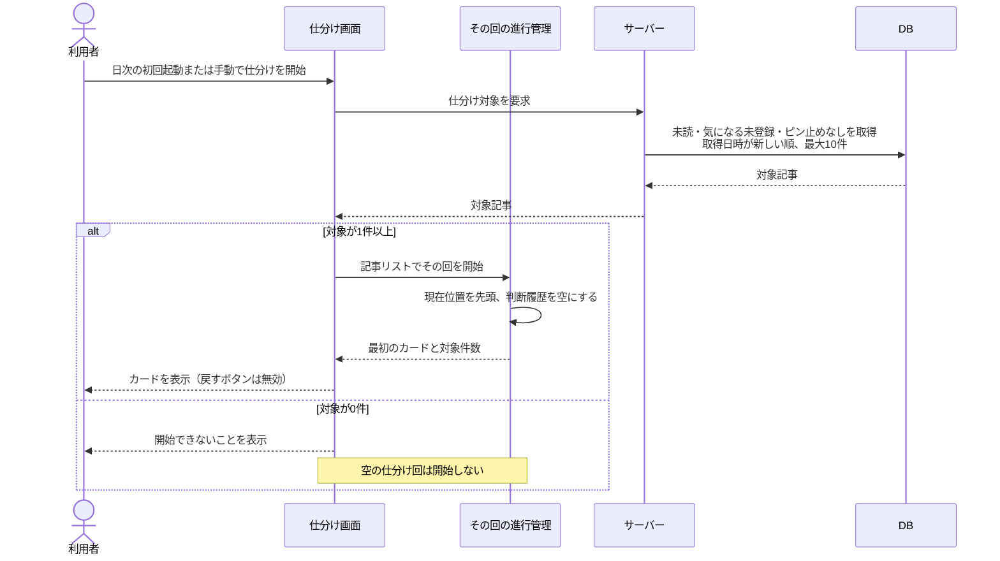
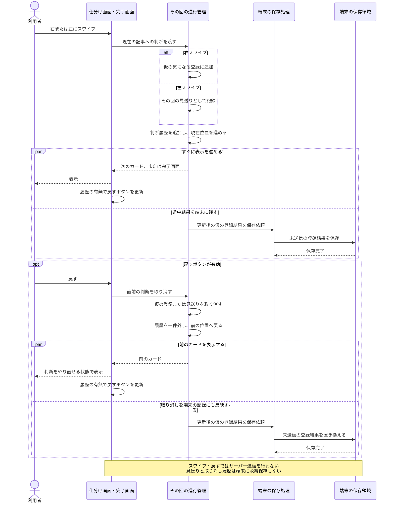
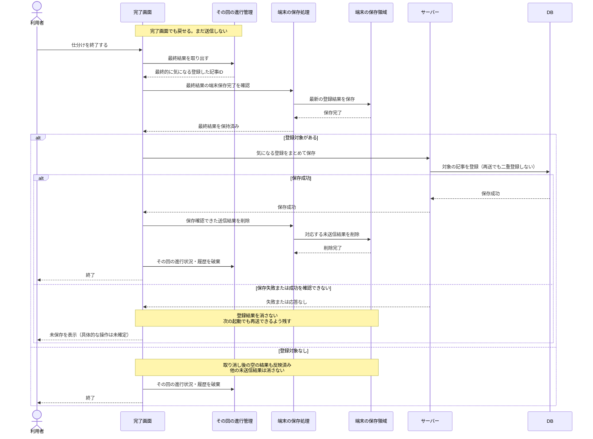
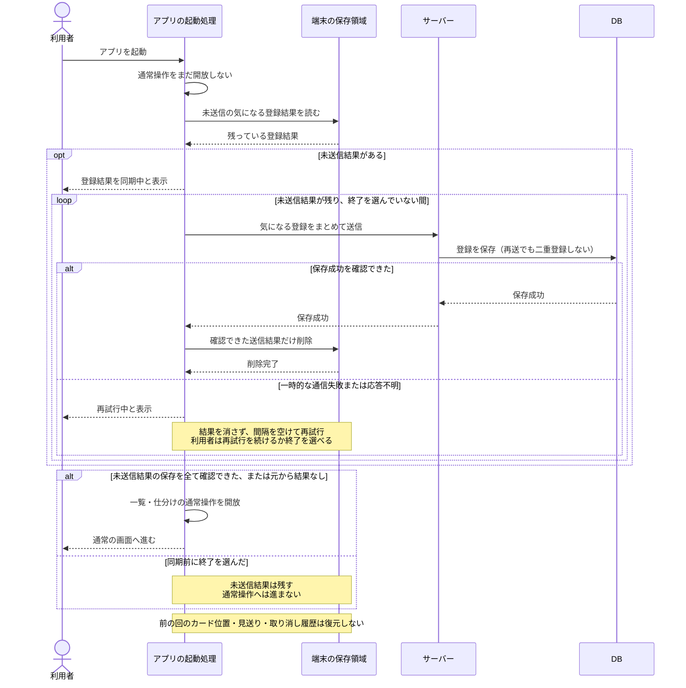
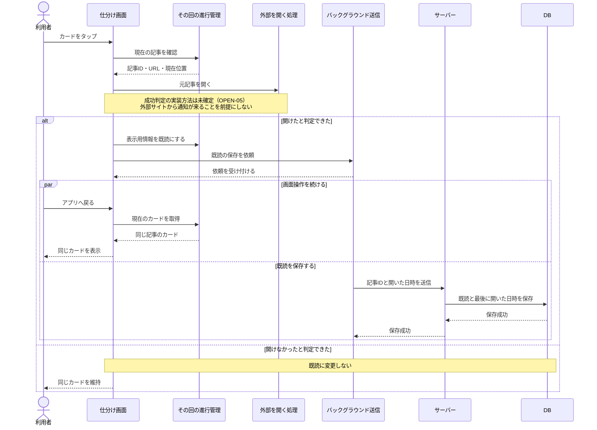

# シーケンス図：仕分けと結果の保存

更新日：2026-10-09

[READMEに戻る](../README.md) · [ルール](rules.md) · [状態遷移図](state-transitions.md) · [ユースケース](use-cases.md) · [一覧のシーケンス](sequences-list.md)

仕分けの操作はサーバー通信の完了を待たずに進める。「気になる」の途中結果を端末に保存し、終了時にまとめて送信する。途中でアプリを閉じても、次の起動時に残っている登録を送信する。仕分けの続き自体は再開しない。

図は上から下へ時間が進む。`alt` は条件分岐、`opt` は条件を満たす場合だけの処理、`par` は並行して進める処理を表す。通常の処理を中心に描いた設計図であり、実装済みの挙動ではない。

## 登場人物と保存する情報

| 登場人物 | 役割 |
|---|---|
| 利用者 | 開始、スワイプ、戻す、記事を開く、終了の操作をする |
| 画面 | カード・完了画面を表示し、履歴の有無で戻すボタンを有効・無効にする |
| その回の進行管理 | アプリのメモリで対象記事・現在位置・判断履歴・仮の気になる登録を管理する |
| 端末の保存処理 | サーバー未保存の気になる登録を非同期で端末へ保存する |
| 端末の保存領域 | 起動し直しても残る未送信の登録結果を保持する |
| バックグラウンド送信 | 画面操作を待たせずに既読の保存を依頼する |
| サーバー・DB | 記事と永続的な気になる・既読・ピン止めを管理する |
| 外部を開く処理 | 元記事を開く。成功判定とブラウザー連携方法は未確定 |

これらは責任を表す役割であり、具体的なクラス名・API名の指定ではない。[技術構成](architecture.md)ではVue・Nest・SQLiteを選び、端末の未送信保存はIndexedDB＋idbで実装する。

端末に残すのは、途中で選んだ「気になる」のうち、まだサーバーに保存できていない結果。見送り・現在位置・取り消し履歴を次の起動のために保存する必要はない。

## 1. 仕分けを開始する

毎日の初回起動時に対象があれば自動開始し、その後も自由に開始できる（SORT-19）。起動時の未送信同期があれば、その完了後に判定する。日次判定の記録先・対象0件時の扱いはIssue #4。外部情報源の収集は呼ばず、DBに保持している記事から選ぶ。開始時の対象リストをその回で保持する案で描く。

ルール：SORT-01〜04・19。1〜9件でも開始できる。起動時に未送信の登録が残っている場合の処理は図4を参照。起動時の同期を完了してから開始する（SORT-18）。

## 2. 登録・見送り・取り消しを手元で処理する

右スワイプによる登録は、終了確定まで仮の判断として扱う。取り消しも手元だけで行い、サーバーへの登録・解除要求は出さない。

ルール：SORT-05〜11、13〜15。履歴がなければ戻すボタンを無効にする。履歴のある範囲で繰り返し戻せる。既読・ピン止めは取り消さない。

端末保存は非同期で、画面表示の前提にしない。ただし保存時間がゼロという意味ではなく、保存完了前の強制終了では最後の変更が残らない可能性がある。

保存処理が前後して古い結果で上書きされないよう、依頼を順序どおり処理するなどの仕組みが必要。図の「更新後の結果」は右スワイプの追加だけでなく、取り消した記事を送信対象から外すことも含む。

## 3. 終了時に最終結果をまとめて保存する

完了画面を出しただけでは送信しない。「仕分けを終了する」で最終的な登録を送る。見送りや途中の判断履歴は送らない。

ルール：SORT-11〜17。「登録対象なし」の場合は気になる保存の通信が不要。

図は最終結果を端末に確保してから送信する設計案。保存成功を確認して消すのは、その送信で確定した結果だけとする。別の未送信結果や、送信後に新しく発生した変更まで消さない。

失敗表示後の再試行・終了操作、送信中の操作制限、端末保存自体に失敗した場合の表示はOPEN-09・12で詰める。サーバーに保存できたのに応答を受け取れなかった場合でも、同じ登録を安全に再送できるようにする。

## 4. 起動時に残っている登録を同期してから操作を開始する

終了直前の通知や送信の成功には依存しない。端末に未送信登録があれば、保存成功を確認するまで一覧・仕分けの通常操作を待機させる。再送前に一覧で解除する操作を受け付けないため、その競合の優先順位は不要。

ルール：SORT-08、14〜18。途中終了していた場合は、端末に残っている最後の登録結果を送る。取り消しが保存済みなら、その記事は送信対象に含めない。

通常の一覧取得は同期完了後に行う。端末の保存領域が消去された場合は未送信結果を復元できない。図は一時的な通信失敗の再試行を扱い、削除済み記事など再送だけでは直らない場合の扱いはOPEN-12で決める。

## 5. 元記事を開き、既読を非同期で保存する

元記事を開く処理と既読を保存する処理を分ける。既読保存の完了を待たずに画面操作を続ける案とする。

ルール：READ-01〜04、SORT-10。外部サイトを開いても気になるへ自動登録せず、現在位置や仕分け判断履歴は進めない。既読を戻す操作で取り消さない。

ブラウザーが開いたこと、ページ読み込み成功、読み終えたことは異なる。どこを成功とみなして観測するかはOPEN-05で決める。外部への移動後も必ずアプリの処理が動き続けるとは限らない。実装環境によっては既読も端末保存・後の送信に寄せる。既読送信の再試行はOPEN-09で設計する。

戻った既読カードの次への進み方、左右スワイプの扱い、処理数への数え方はOPEN-03のまま。

## 関連するシーケンスとクラス図

[クラス図](classes.md)にデータ・アプリ・サーバーの責任を整理した。

[一覧の取得・追加読み込み・登録とピンの表示変更・元記事を開く処理](sequences-list.md)、[サーバーの定期収集・更新・保持と削除](sequences-server.md)は別のシーケンスにまとめた。今回の一括送信は仕分けの登録を対象とし、一覧の変更まで一括送信にする仕様ではない。

クラス図では、進行管理、端末への未送信結果の保存、送信・再送、サーバー側の登録をそれぞれの責任として検討する。
