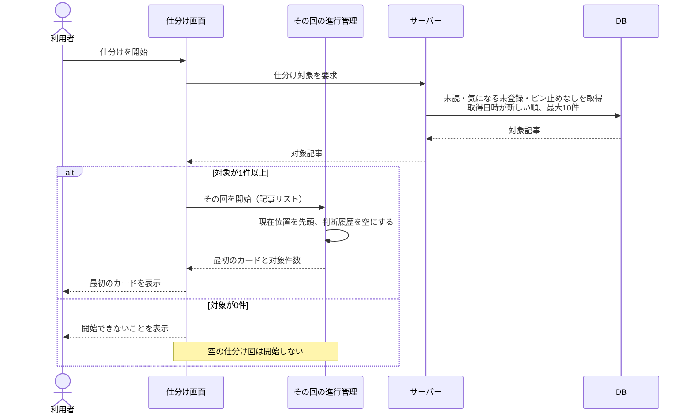
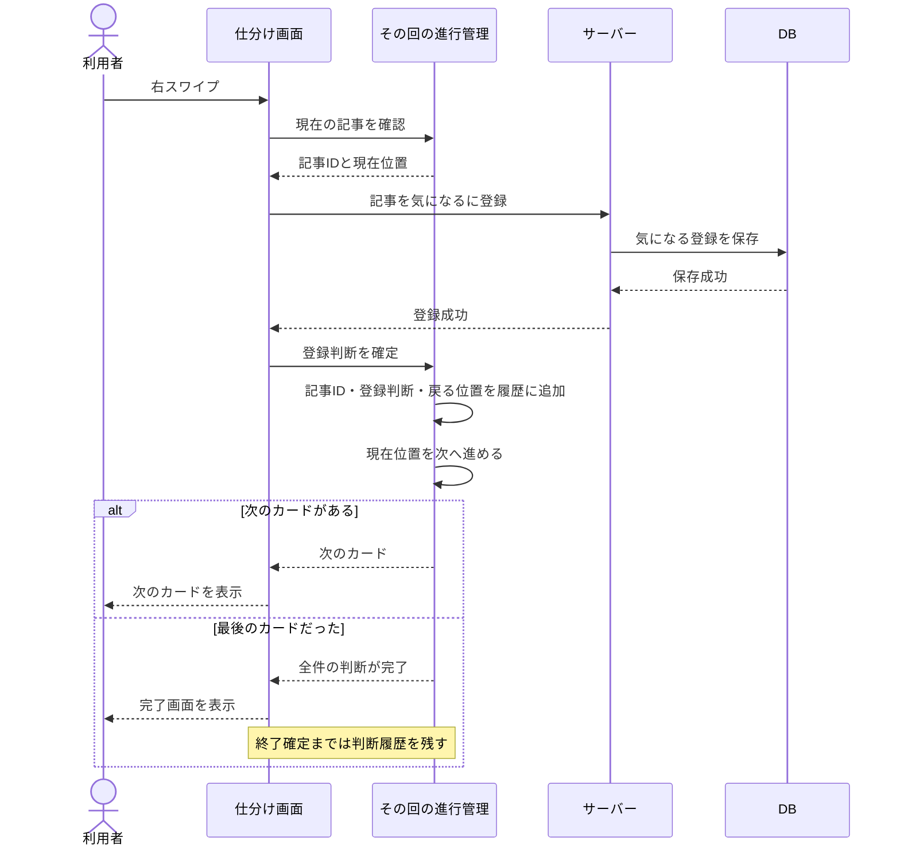
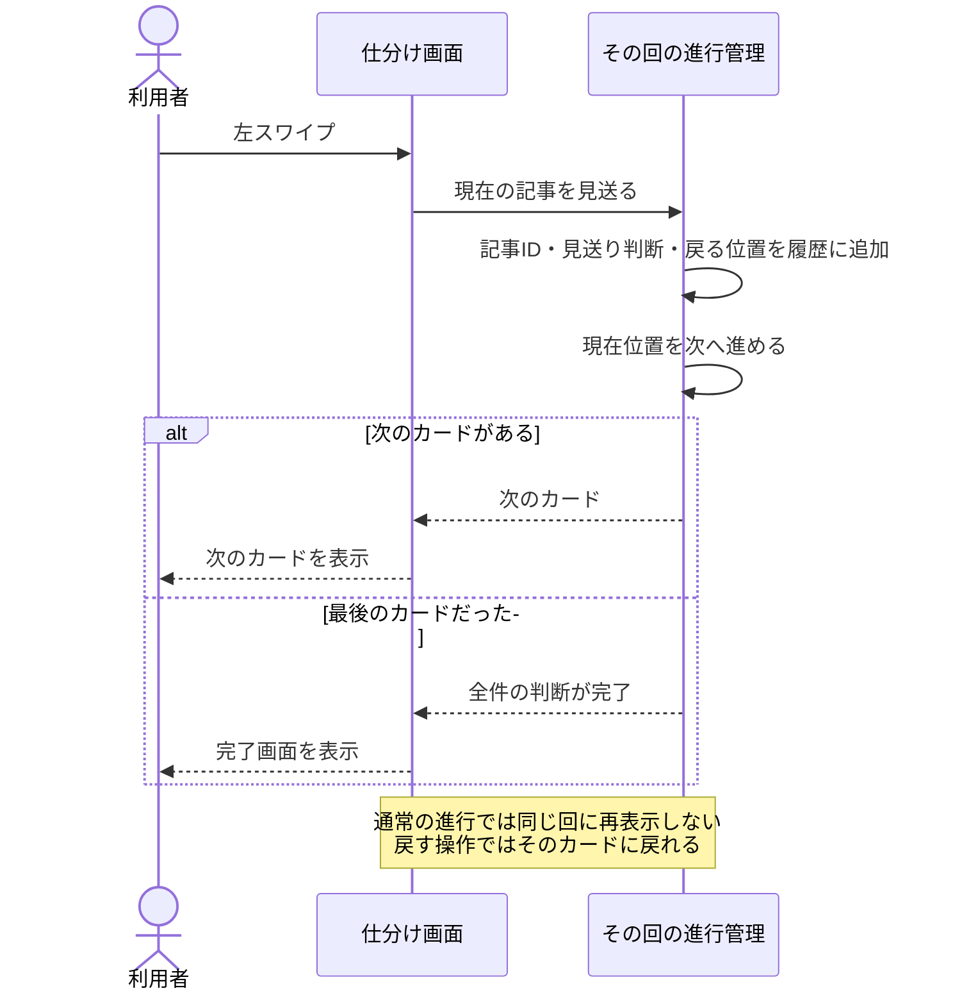
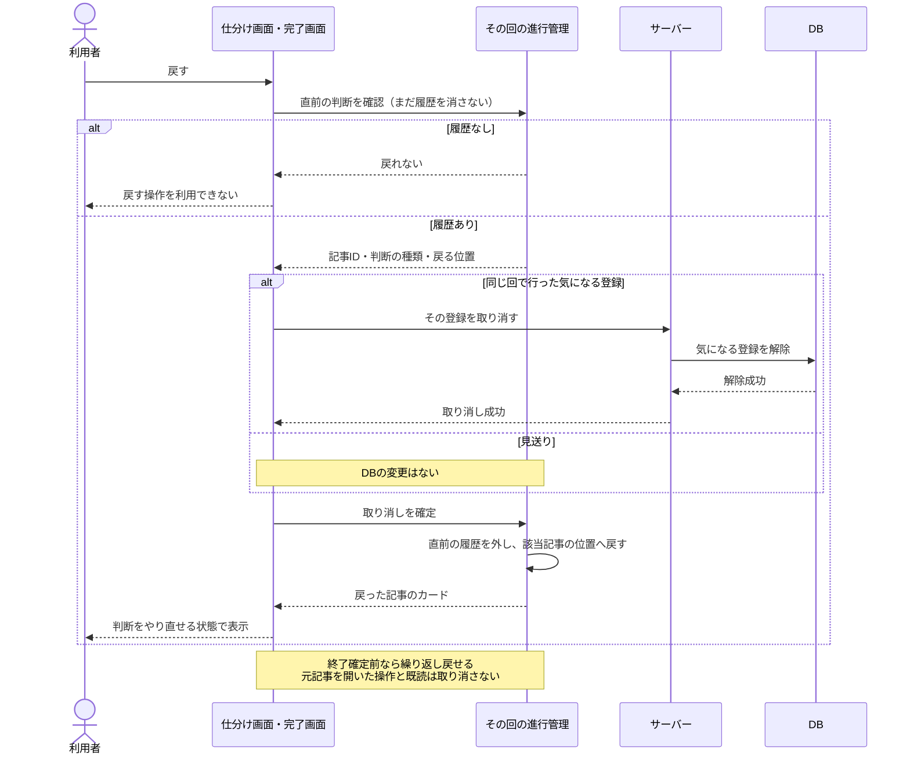
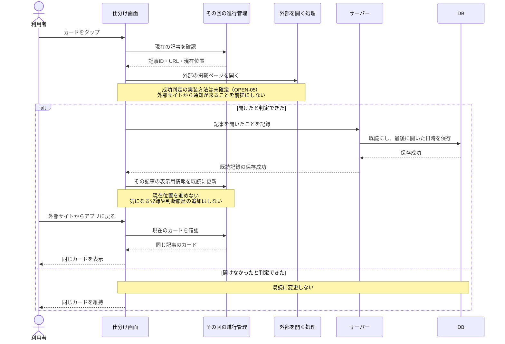

# シーケンス図：仕分けの基本操作

更新日：2026-10-08

[READMEに戻る](../README.md) · [ルール](rules.md) · [状態遷移図](state-transitions.md) · [ユースケース](use-cases.md)

仕分け開始、気になる登録、見送り、取り消し、元記事を開く操作について、画面・処理・DBのやり取りを示す。図は上から下へ時間が進み、実線の矢印は要求、破線の矢印は応答を表す。`alt` は条件による分岐。

## 図の登場人物と設計案

| 登場人物 | 役割 |
|---|---|
| 利用者 | 開始、スワイプ、戻す、記事を開く操作をする |
| 仕分け画面 | 操作を受け取り、カードや完了画面を表示する |
| その回の進行管理 | 対象記事、現在位置、判断履歴を一時的に管理する |
| サーバー | 対象記事を選び、気になる・既読などの変更を処理する |
| DB | 記事と、永続的に残す登録・閲覧状態を保持する |
| 外部を開く処理 | 外部の掲載ページを開く。実際のブラウザー連携方法は未確定 |

これらはクラス名やAPI名を確定したものではなく、責任を検討するための役割である。

**設計案として置く前提：** その回の進行管理はアプリ側のメモリに置く。DBへ残すのは気になる・既読・ピン止めなどで、見送りと取り消し履歴は永続保存しない。アプリを閉じた回を再開しないルールに合わせた案であり、配置はクラス図で見直せる。

開始時の対象リストをその回で保持する案で描く。定期収集や削除で対象が変わる場合、一覧操作や他端末との競合、具体的な失敗時の再試行は未決事項として残す。通常の成功経路を中心にした設計図であり、実装済みの挙動ではない。

## 1. 仕分けを開始する

外部の情報源から記事を収集する処理は呼ばず、DBにある記事から選ぶ。

ルール：SORT-01〜04。1〜9件でも開始できる。対象件数は開始時のリストの件数であり、必ず10件を処理するわけではない。

## 2. 気になるに登録して次へ進む

登録をDBに保存する処理と、その回の判断履歴を作る処理を分ける。

ルール：SORT-05、09、11、LIST-01。

設計案では、サーバーへの保存成功を確認してから判断を確定し、履歴と位置を進める。通信・保存に失敗したときの再試行や、保存できたが応答を受け取れなかった場合の扱いは、OPEN-09と処理設計で決める。

以前から登録済みの記事は開始時の対象に含まれない。その回で行った登録だけが、その回の取り消し履歴に入る。

## 3. 見送って次へ進む

見送りはその回の進行管理だけを変更する。DBへ見送り状態を保存する処理は不要。

ルール：SORT-05〜08、11。見送り記事は次の回では、他の記事と同じ対象条件・取得日時順で選べる。

## 4. 直前の判断を取り消す

見送りの取り消しはその回だけを戻す。気になる登録の取り消しはDBの登録も外す。既読やピン止めを記事全体の古い状態で上書きしない。

ルール：SORT-09〜11。その回の登録をDBから取り消すのは、保存成功後に履歴へ入った登録判断に限る。

解除に失敗した場合、設計案では履歴・現在位置をまだ変更しない。再試行方法、別画面・別端末の変更と競合した場合は未確定（OPEN-02、08、09）。

## 5. 元記事を開き、同じカードに戻る

外部を開く処理と、サーバーに既読を保存する処理を分ける。「開けた」の実際の判定方法は未確定のため、図は要件上の成功・失敗を表す抽象的な分岐として描く。

ルール：READ-01〜03、SORT-10。ブラウザーが開いたこと、ページの読み込みが成功したこと、読み終えたことは同じではない。どこを成功とみなして観測するかは、実装環境の確認後に決める。

外部画面への移動でアプリの処理が中断される場合の既読保存タイミング・保存失敗の扱いも未確定。図の「保存成功」は通常経路を表し、保存の完了まで外部表示が待機する仕様ではない。

戻った既読カードから次へ進む方法、左右スワイプの扱い、10件の判断数への数え方は引き続きOPEN-03であり、この図では新しく確定しない。

## 終了確定とアプリ終了

- 完了画面の表示だけでは終了確定しない。その回の判断履歴を残し、取り消せるようにする。
- 「仕分けを終了する」で対象リスト・現在位置・判断履歴を破棄する。
- アプリを閉じても、その回を次の起動で再開しない。
- DBに保存した気になる・既読・ピン止めは、回を破棄しても残る。

途中で一覧へ移動する場合は、アプリ終了とは別の未決事項として扱う（OPEN-02）。

## 次に扱う処理

一覧の取得・更新、一覧からの気になる登録・解除、ピン止め、サーバーの定期収集・更新・削除は、次のシーケンス図で扱う。

今回の図で確認する設計案は、進行管理をアプリ側の一時データとして持つこと、DBへの登録・解除成功後に進行を確定すること、既読更新を仕分けの判断履歴から分離すること。合意済みのルールそのものを変更するものではない。
