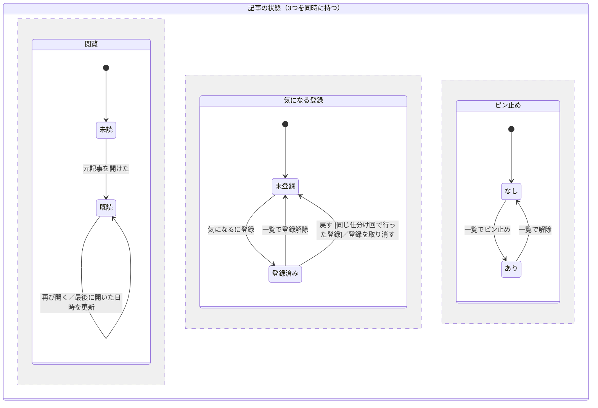
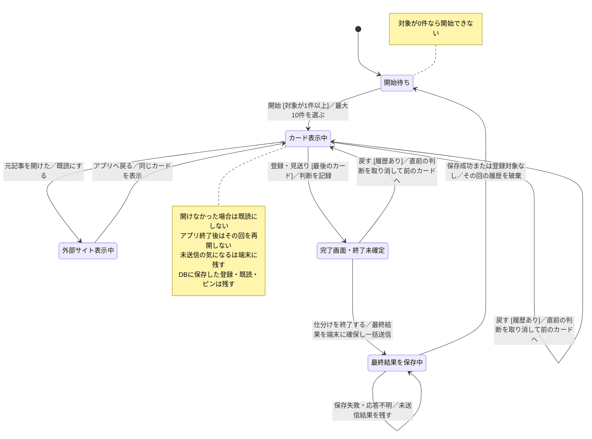
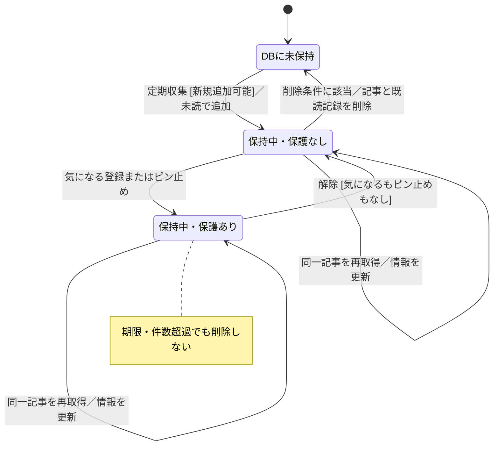

# 状態遷移図

更新日：2026-10-08

[READMEに戻る](../README.md) · [アプリのルール](rules.md) · [ユースケース](use-cases.md)

記事の状態、一回の仕分けの進行、記事の保持と削除を分けて表す。四角は状態、矢印は状態を変える操作・出来事を表す。`[条件]` はその遷移が可能な条件、`／` の後は遷移時に行う処理を表す。

図はMarkdown内のMermaidコードとして編集でき、GitHub上で表示される。未決事項を新しい仕様として確定させず、末尾にまとめている。

## 1. 記事の状態

閲覧・気になる登録・ピン止めは独立した状態で、同時に成立する。例えば「既読・気になる登録済み・ピン止めあり」の記事も存在する。破線の区切りは、この3つの状態を同時に持つことを表す。

初期状態は新規記事を取り込んだときの状態。既存記事を再取得した場合は、状態を初期化しない。

仕分け開始時の対象は、**未読・気になる未登録・ピン止めなし**の記事。

登録済みから「戻す」で未登録になるのは、その回で右スワイプして選んだ仮の登録を取り消す場合だけ。以前から登録済みの記事を仕分け対象に出して外す意味ではない。

この図の「気になる」は利用者の判断を表す。仕分け中は手元の仮の登録を変更し、DBへの保存は終了時にまとめて行う。途中で閉じた場合は、端末に残った未送信の登録を次の起動時に送る。取り消しでDBの登録解除を毎回行うわけではない。保存先と送信の流れは [シーケンス図](sequences.md) を参照。

見送りは記事の永続的な状態ではなく、その回の一時的な記録である。記事の情報が更新されても、閲覧・登録・ピン止めの状態は維持する。

参照：[記事を開く・表示のルール](rules.md#表示記事を開く)、[登録・ピン止めのルール](rules.md#気になるピン止め一覧)。

## 2. 一回の仕分けの進行

カードを表示していることと、その記事が未読であることは別。元記事を開けたら既読になるが、外部サイトから戻ったときは同じカードを表示する。

- 「戻す」は前のカードを表示するだけでなく、そのカードで行った判断も取り消す。
- 戻す操作はその回の履歴がある範囲で繰り返せる。完了画面でも終了確定までは使える。
- 見送りは同じ回での再表示を防ぐ。ただし、取り消しで戻る場合は除く。
- アプリを終了した回の再開はしない。端末に保存済みの未送信登録は次の起動時に送るが、カード位置・見送り・取り消し履歴は復元しない。
- 端末の未送信結果は、サーバーへの保存成功を確認したものだけ削除する。保存失敗後の操作・再送失敗時の次の回の対象選択はOPEN-09・12で決める。
- 保存中の状態は通常経路を表す。端末保存自体の失敗と送信中の操作制限は、処理設計で詰める。
- 元記事を開く操作は判断の取り消し対象ではない。戻す操作で既読を未読に戻さない。

既読になったカードの次への進み方・件数への数え方、途中で一覧へ移動したときの扱いは未確定。上の登録・見送りの矢印は通常の判断の流れを示し、これらの未決事項を確定するものではない。

参照：[仕分けのルール](rules.md#仕分け)。

## 3. 記事の保持と削除

サーバーのDBで気になる登録・ピン止めのどちらかがあれば自動削除から保護される。両方なくなったときに、通常の削除対象へ戻る。仕分け中の仮の登録は、サーバー保存が完了するまでDBの保護状態を変更しない。送信前の削除との整合性はOPEN-04・12で決める。

「DBに未保持」は未取得・削除済みを表す説明上の状態であり、未保持記事のレコードをDBに残す指定ではない。

### 削除条件

| 条件 | 対象・順序 |
|---|---|
| 保持期限を超えた | 保護されていない未読が対象。取得日時からの保持期間で判定する |
| 件数上限を超えた | 保護されていない未読を、取得日時が古い順に削除する |
| 未読を削除しても件数超過 | 保護されていない既読を、最後に開いた日時が古い順に削除する |

既読記事は期限では削除しない。削除後に同じ記事を再取得した場合、未読として追加されることは許容する。

### 新規追加の停止・再開

保護記事だけで上限に達した場合、新規記事の追加を停止する。既存記事の情報更新は続ける。保護記事が減って空きができれば、次の定期収集タイミングで新規追加を再開する。

参照：[保持・削除のルール](rules.md#保持削除取得停止)。

## 図に残る未決事項

| ルール文書のID | 内容 |
|---|---|
| OPEN-01 | 取得日時を初回取り込み時点で固定するか |
| OPEN-02 | 仕分け中に一覧へ移動した場合の回・履歴の扱い |
| OPEN-03 | 外部サイトから戻った既読カードの次への進み方、左右スワイプ、件数への数え方 |
| OPEN-04 | 定期収集・削除と進行中のカードの整合性 |
| OPEN-05 | 外部サイトを開けたかどうかを実装上どこまで判定できるか |
| OPEN-09 | 処理に失敗したときの再試行・中断・継続 |
| OPEN-12 | 端末保存・再送・未送信結果と一覧や削除の整合性 |

取得処理の失敗などを含む遷移は、処理単位の整理とルールの確認後に追加する。全体の未決事項は [ルール文書](rules.md#未決事項) を参照。
