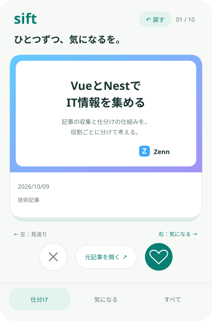

# 画面構成の参照

更新日：2026-10-09

[READMEに戻る](../README.md) · [技術構成](architecture.md) · [表示ルール](rules.md)

## 採用したカード構成

比較モックの「サムネの中」を採用する。タイトルと小さい説明をサムネイル領域内に置き、出典アイコン・サイト名で情報源が分かるようにする。下部は日付などのメタデータを表示する。著者は必須にしない。

この図は、採用した配置をリポジトリで確認するための静的な構成図。文面と日付は架空のサンプルであり、実データではない。色・余白・文字サイズは実装時に長い日本語タイトルとスマホ幅で確認する。下部の画面名は利用場面を示すものであり、仕分け中のタブ移動を確定するものではない。

| 領域 | 内容 |
|---|---|
| サムネイル領域 | 中央揃えのタイトル、小さい説明、出典アイコン・サイト名 |
| 下部 | 日付などのメタデータ。取得できない説明・公開日は項目を表示しない |
| 仕分け操作 | 左で見送り、右で気になる。元記事は直接外部で開く |
| 戻す | 判断履歴があれば有効。終了確定前は完了画面からも戻せる |
| 一覧 | 同じ出典・タイトル・説明の構成を使う。ピンをサムネイル付近の左上に置く |

画像のない情報も、この文字と出典の構成で表示できる。情報源によってカード全体の面積を変える方針にはしない。長い文面の折り返し・省略の詳細はIssue #10で、判定に必要な情報が読めるか確認する。

## モックと確定仕様の区別

手元の比較モックは表示位置とスワイプの感触を確認するためのもの。旧モックの「あとで読む」「記事の詳細」、5件固定、手動既読変更などを、そのまま要件にしない。実装の基準は[ルール](rules.md)とシーケンスであり、現在は次のとおり。

- 表記は「気になる」に統一する。
- 元記事をタップすると外部サイトを直接開き、アプリ内の詳細画面は設けない。
- 仕分けは最大10件。対象が1〜9件でも開始でき、0件で開始不可。
- 毎日の初回起動時に対象があれば自動開始する。未送信登録があれば同期後に判定し、その後も自由に仕分けを開始できる。
- 判断中は手元で処理し、登録結果を端末に残す。終了確定でサーバーへ一括送信する。
- 未送信登録があれば次回起動時に同期する。カード位置・見送り・履歴の再開はしない。
- 既読・未読の手動変更は実装しない。
- 仕分け中の画面移動、外部を開いた後の操作、送信失敗のUIはIssue #4で確定する。

ローカルのlocalhost URLはリポジトリの利用者から開けないため、参照先として使わない。この構成図と上の表で配置を確認し、Issue #10・#13の実装後は実際の画面を追加する。
