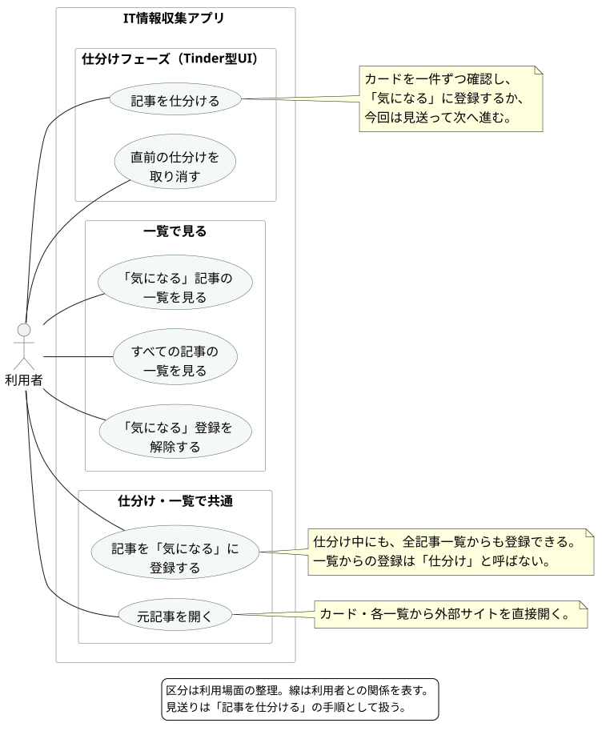

# ユースケース

[READMEに戻る](../README.md) · [アプリのルール](rules.md)

利用者がアプリで達成したいことを、仕分け・一覧・共通機能に分けて表す。区分は利用場面の整理であり、操作順序やクラスの分割を指定するものではない。



[SVGを開く](diagrams/use-cases.svg) · [PlantUMLコード](diagrams/use-cases.puml)

## 合意したユースケース

| 利用場面 | ユースケース | 内容 |
|---|---|---|
| 仕分け | 記事を仕分ける | カードを一件ずつ確認し、気になる登録または見送りを判断して進む |
| 仕分け | 直前の仕分けを取り消す | その回の判断を戻し、該当カードに戻る。繰り返してさかのぼれる |
| 一覧 | 気になる記事の一覧を見る | 気になる登録した記事を見る |
| 一覧 | すべての記事の一覧を見る | DBに保持している記事を見る。見送った記事も含む |
| 一覧 | 気になる登録を解除する | 登録を外す。見送りとは別の行動 |
| 共通 | 記事を気になるに登録する | 仕分け中と全記事一覧から登録する。一覧からの登録は仕分けとは呼ばない |
| 共通 | 元記事を開く | カードや一覧から外部の掲載ページを開く |

見送りは「記事を仕分ける」の手順として扱う。アプリ内の詳細画面と、既読・未読の手動変更は含めない。自動的な既読処理や記事の収集は、利用者の操作目的と区別してルール・処理設計で扱う。

## 図の合意後に追加した要件

一覧からピン止めを設定・解除できる。ピン止めは気になる登録とは独立し、仕分け対象からの除外と自動削除からの保護に使う。

この図はピン止めを決める前の合意版を保持しているため、ピン止めの設定・解除はまだ図に含まれていない。現在の要件は [アプリのルール](rules.md) を参照し、次の図の見直しで反映する。

## 図の再生成

PlantUMLとJava、Graphvizを利用できる環境で、リポジトリのルートから実行する。

```sh
java -jar /path/to/plantuml.jar -charset UTF-8 -tsvg docs/diagrams/use-cases.puml
```

`docs/diagrams/use-cases.svg` が生成される。実行ファイルはこのリポジトリには含めない。
